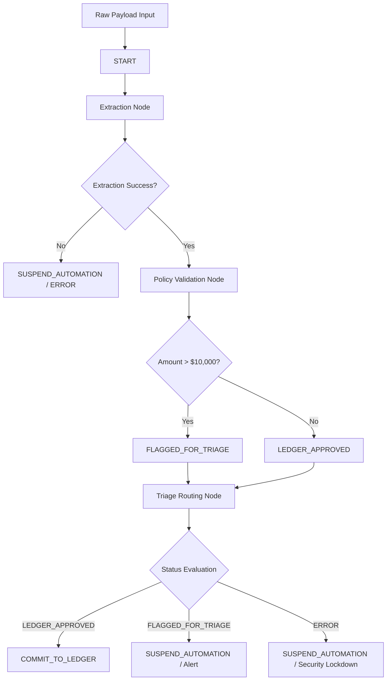

# DNA: System Architecture & Design Principles

This document details the system design, core patterns, and operational guardrails for the **Automated Customer Compliance & Finance Triage System**.

---

## 🏗️ Architectural Overview

The system uses a graph-based multi-agent layout powered by the **ADK 2.0 framework**. Instead of executing linear processing code (which is prone to regression and logic drift), the pipeline implements a state machine workflow consisting of specialized nodes communicating through an immutable `GraphState`.

### 1. Unified State Container (`GraphState`)
All nodes receive and return an instance of `GraphState`. This ensures:
- **Traceability:** State changes are logged in the `logs` list field, providing a complete audit trail of how an invoice was processed.
- **Safety:** Downstream operations can inspect the `status` and `directive` variables to halt processing if any anomaly is flagged.

### 2. Specialized Processing Nodes
- **Extraction Node:** Standardizes payload keys (accepting both `invoice_id`/`id` and `vendor_name`/`vendor`), parses types safely, and detects missing or malformed inputs.
- **Policy Validation Node:** Enforces the strict compliance threshold. Transactions `<= $10,000` are approved; transactions `> $10,000` are flagged for human triage.
- **Triage Routing Node:** Acts as the execution firewall. Enforces Human-in-the-Loop review by setting the directive to `SUSPEND_AUTOMATION` whenever a transaction is flagged or in an error state.

---

## 🔒 Security Hardening & Compliance Governance

### 🛡️ Shift-Left Code Quality & Security
To ensure reliability before deployment, static code check configs are integrated directly into `pyproject.toml` using:
- **Flake8:** Enforces PEP 8 standards with custom strict limits (max line length 88).
- **Semgrep:** Leveraged to inspect runtime exceptions and intercept dangerous patterns or syntax drift before code is committed.

### 🛑 Human-in-the-Loop Triage
Automated processes cannot override safety limits. High-value anomalies (exceeding `$10,000`) or extraction exceptions will immediately lock down downstream automation, ensuring that transaction commits to the ledger always require explicit administrative review.
